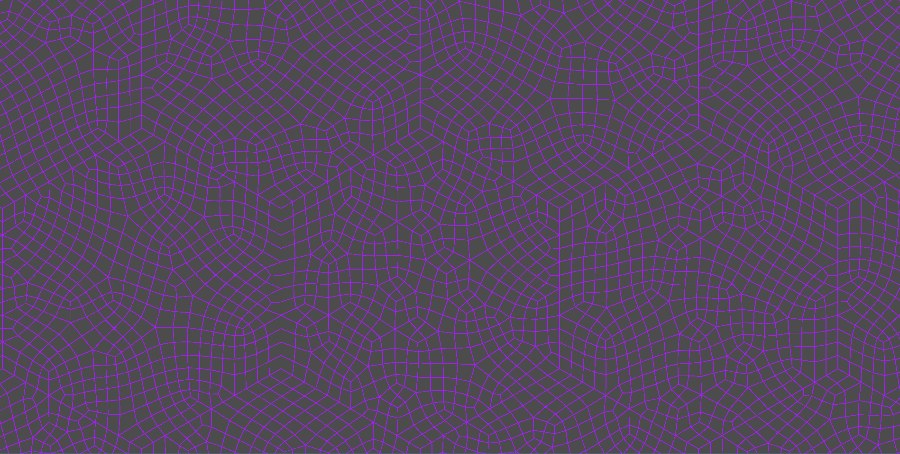

# Godot Stålberg Grid

A Godot implementation of an infinitely generated generated, inspired by Oskar Stålbergs technique described in https://youtu.be/Y19Mw5YsgjI?si=EfyuK2gv5b27SNS6. It creates an interesting grid shape that could be used for procedural generation tasks such as city generation.

It generates as following:

- Generate a hexagon grid of vertices
- Combine the vertices into bands of triangles
- Randomly dissolve pairs of triangles into quads
- Subdivide each triangle that is left
- Subdivide each quad
- Run multiple iterations of point relaxation (Laplacian smoothing)
- Generate more hexagons. Due to the hexagonal shape and the lack of movement of border vertices everything tiles perfectly, and all the lines connect.